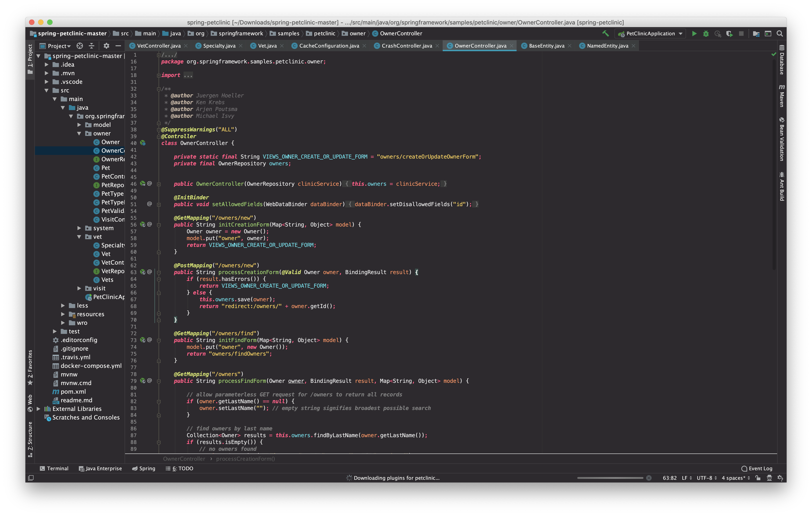

# Solarized JetBrains

Changes your JetBrains IDE to fit the [Monokai Pro](monokai.pro) colorscheme.
Special thanks to Tyler Thrailkill for his first [implementation of the Solarized 
Theme](https://plugins.jetbrains.com/plugin/12112-solarized-theme) which served as 
an excellent starting point for this plugin.

Uses JetBrains new [custom theming](https://blog.jetbrains.com/idea/2019/03/brighten-up-your-day-add-color-to-intellij-idea/) to
add Monokai Pro to the entire IDE. Only works in 2019.1+

# Contributing

Modify the `Monokai_Pro.theme.json` file and just run `Plugin` from the build window,
this opens up a new IDE window and you can switch to the theme there.
I'm happy for any contributions.
