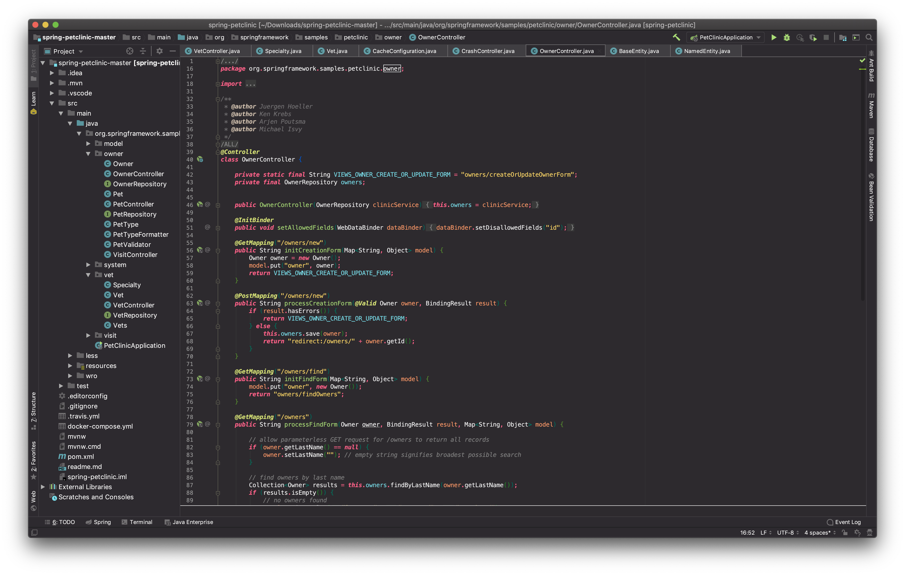

# Monocai Theme for JetBrains

Changes your JetBrains IDE to fit the Monocai colorscheme, inspired by [Monokai Pro](monokai.pro).

Uses JetBrains new [custom theming](https://blog.jetbrains.com/idea/2019/03/brighten-up-your-day-add-color-to-intellij-idea/) to add the colorscheme to the entire IDE. Only works in 2019.1+.

## Contributing

Modify the `Monocai.theme.json` file and just run `Plugin` from the build window,
this opens up a new IDE window and you can switch to the theme there.
I'm happy about any feedback.

## Thanks

Special thanks to:

* Tyler Thrailkill for his [implementation of the Solarized 
Theme](https://plugins.jetbrains.com/plugin/12112-solarized-theme) which served as 
an excellent starting point for this plugin.
* Monokai for the [Monokai Pro colorscheme](monokai.pro).
